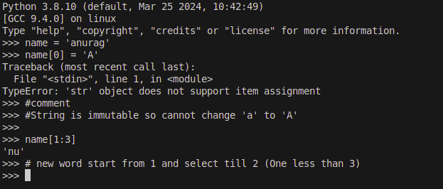
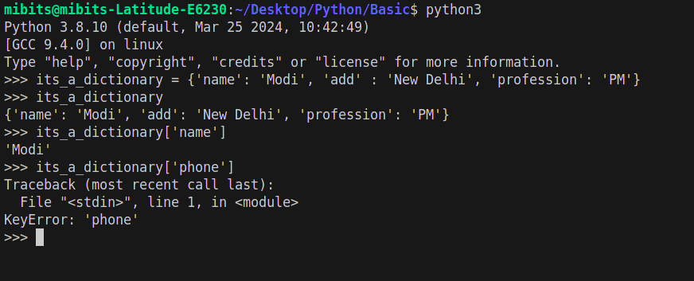
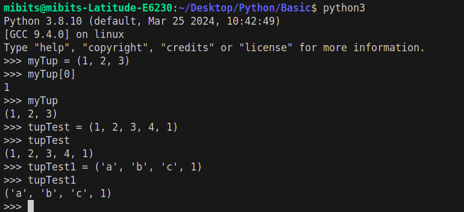
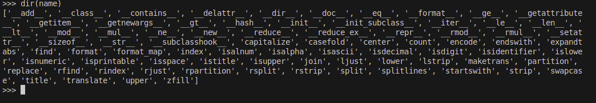

# Python DataTypes

- Number : 108, 1.08, 1+8i, 0b111, Decimal(), Fraction()
- String : 'mithu' , "It's Mithu", b'a/x01c', u'sp\xc4m'
- List : [1, [2, 'two'], 3.2], list(range(5))
- Tuple : (1, 'mithu', 3, 'ANURAG'), tupple('mithu'), namedtuple
- Dictionary : {'name' : 'mithu', 'loc' : 'India'}, dict(age=34)
- Set :  set('mithu'), {'m', 'i', 't'} 

- File : open('mitnote.txt'), open(r'D:\mit.bin', 'wb')

- Boolean : true, false
- None : None 

- Function, module, classes

- Advance : Decorator, Generator, Itarator, MetaProgramming

# Code examples

- String : 

- Dictionary : 

- Tuple : 

- Help :

