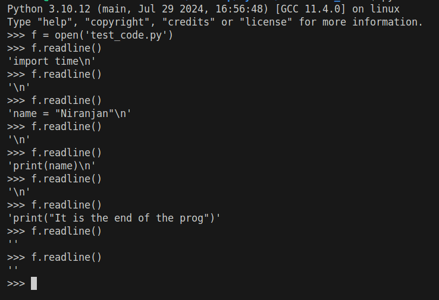
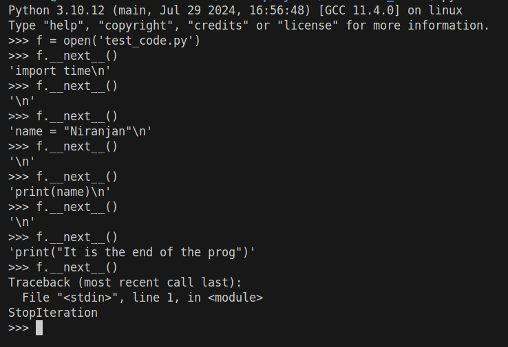
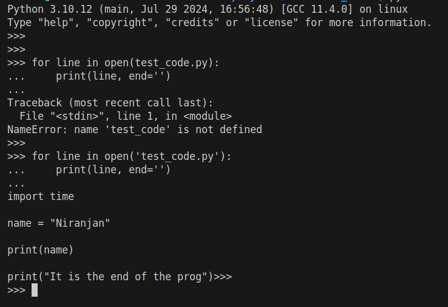
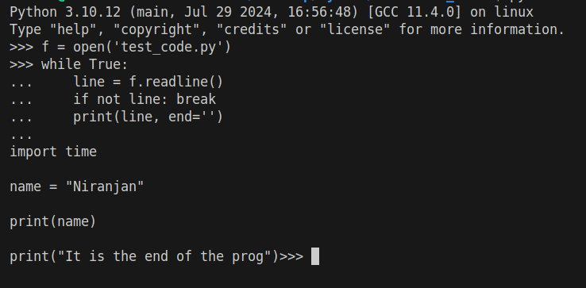
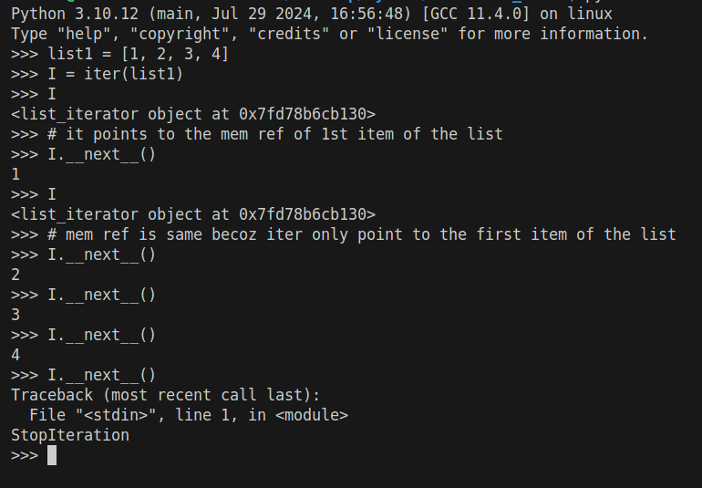
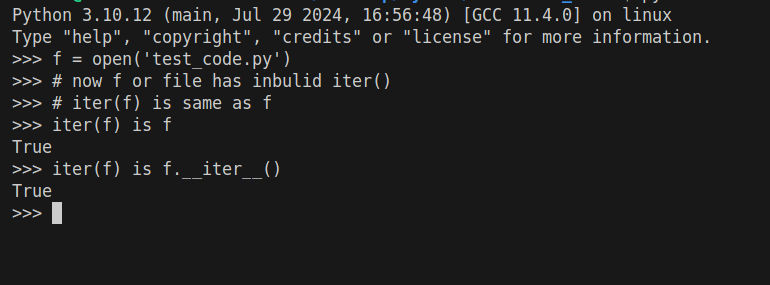
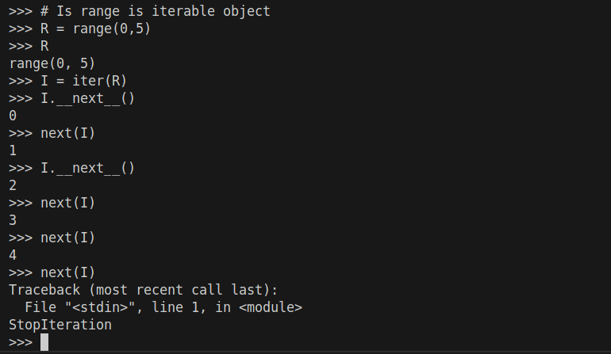

# Iteration or Loops how its work in Python

> **Iteration Tools internal working** : Iteration tools like for, comprehension, etc are the main controller for iteration and it need a iterable object(list, file, etc) for doing iteration and also need a <span style="background-color:green">__next__ </span> to control the iteration or check the iterable object is reach to an end for stop the iteration. In the internal mechanism, actually iteration tools call a iter() method to start the iteration on a iterable object and reach to the memory location of the first item on the iterable object and generate a _ _next_ _ to allow the next item to be read and when it reach the last item on the object a iteration interupt is called and stop the iteration by the iteration tool.

>> To explain it clearly, create a python prog in a file called "test_code.py" where the code is
```
import time

name = "Niranjan"

print(name)

print("It is the end of the prog")
```

and if we run a python3 shell and execute like below in the image then we get some idea about how the iteration tools are worked behind the schene



when prog reach to its last line and again call readline() then it return '' becoz the --next-- is not generate this time becoz it is the end of the iterable object. To understand more let use __next__ directly on shell



If we implement this useing for :



If we implement this useing while :



- File iterable object has their own inbulid iter() method so we need not to exactly called iter() method directly but other iterable object like list must need to call iter() method to get the memory ref of the first item of that particular list, and then to iter to next item on list __next__ taking care of it. Here an example



Wherese file has its own iter() method so its need to call like in list



Is range() is a iterable object in python let check it. if iter() method is point to the first item of the range then yes it is iterable.



