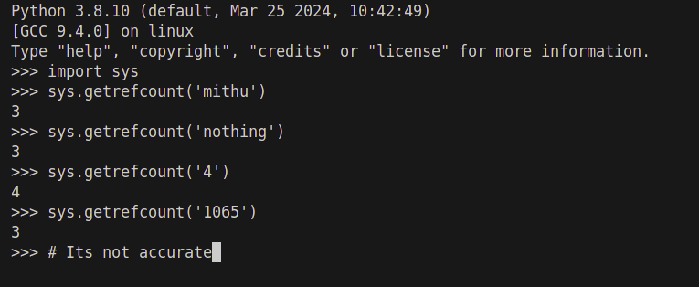
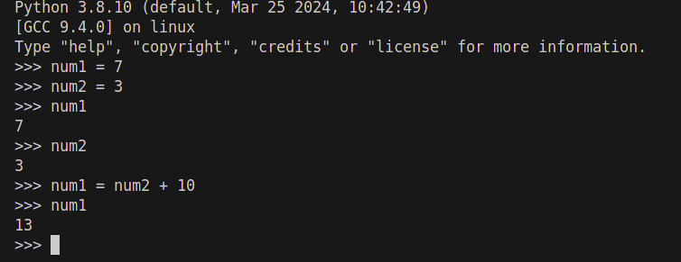
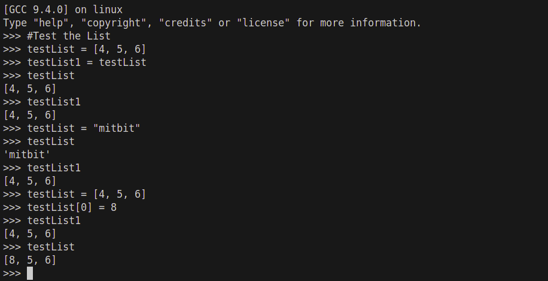
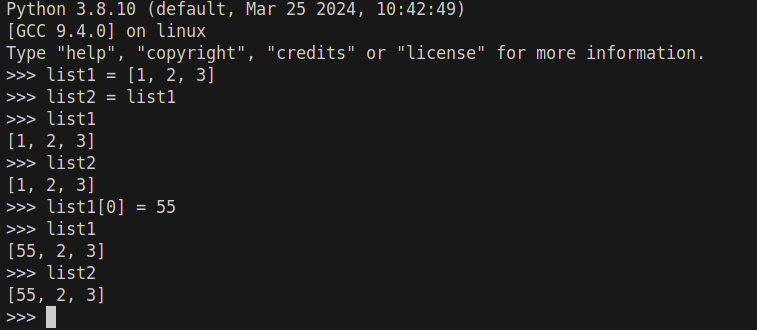
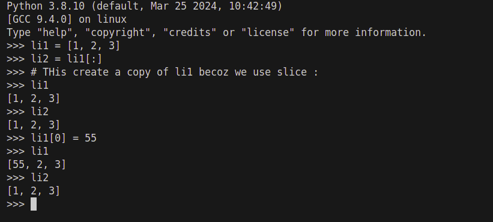
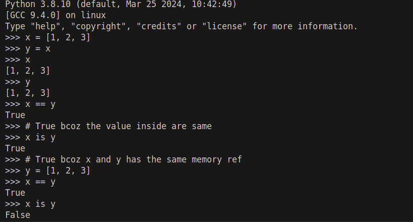
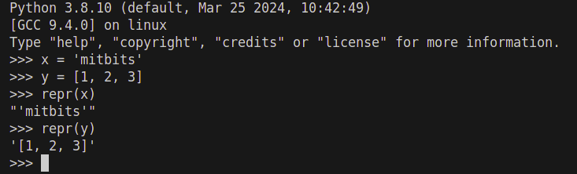

# Notes on Python 

 

- Reference Count in Python : As  we know that variable name reference to a memory location in a memory which has its types, data and also has a reference count. And if we change reference of the memory location for the same variable name, the past reference of the memory shoud be remove by the garbage collector if that memory location refernce not used by any other variable name.There are some ways to know the reference count for any particular memory location value.Some method for refernce count import from sys but its not work properly.

 

- Describe from below code :

Description: first create a variable name which ref a memory location which hold a number value 7 then create another variable name which ref another memory location which hold a number value 3. Now again when we initiate a calculation in first variable name according to python internal whenever any calculation initiate if there is any variable name declare on the calculation first get the ref value from the ref memory location and then calculate or process the calculation. After the calcultion complete the result value then hold into a newly created memory location and then reference that value from the memory location to first variable name. After that if the past value from the mem loc is not in use then delete it by garbage collector(not immediately)

 
- Description about List :  List is mutable so the value could be change

But in Some cases like below

We can trick to make a copy of list by useing sliceing [:]. Ya ofcourse we can also use copy by import it. like >>> import copy >>> li2 = copy.copy(li1) . We also use deepcopy to copy the inner list between a list

If "x == y" then it check the value of x and y are same or not, and if "x is y" then it check both x and y point to same memory reference or not

- Oparator Overloading : If we add two string like 'mit' + 'bit', then + or oparator automatically distinguish the value whether it is string or number or anything. This featur is called oparator overloading.

- repr() : repr is a built in python function return the printable representation of specify object as string.
