# Numbers in Python

- Numbers are very important part of python, in python it is possible do huge or complex calculation over number. 

- Some Testing with Numbers

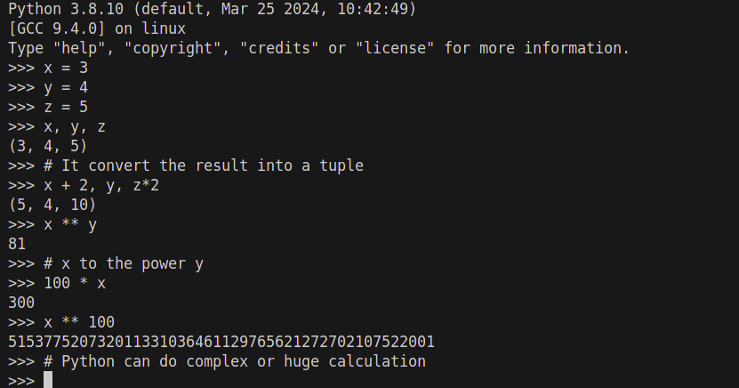

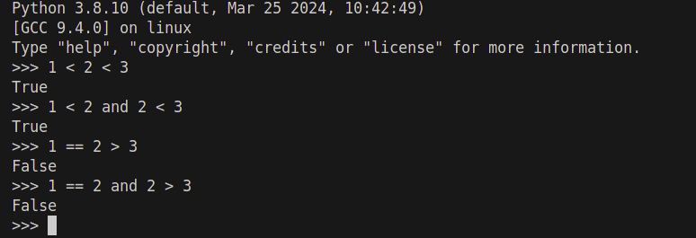

- There are many library to import for number computation one of the popular and simpler is math. 

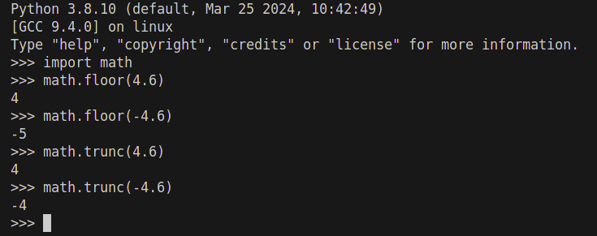
    Here floor return the nearest below value and in trunc it return the nearest value towards 0

- Binary, Octal and hexadecimal numbers

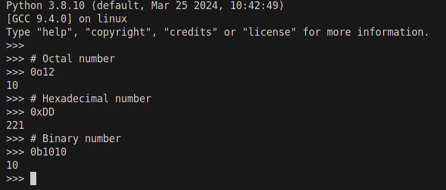

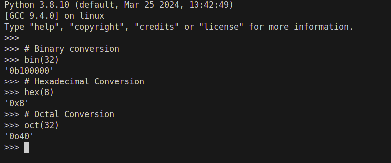

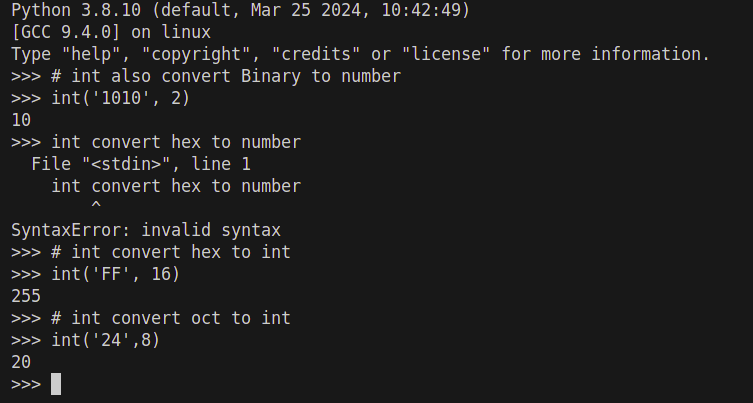

- Some import library on number can extends it higher, some of are 
     
    random: 

    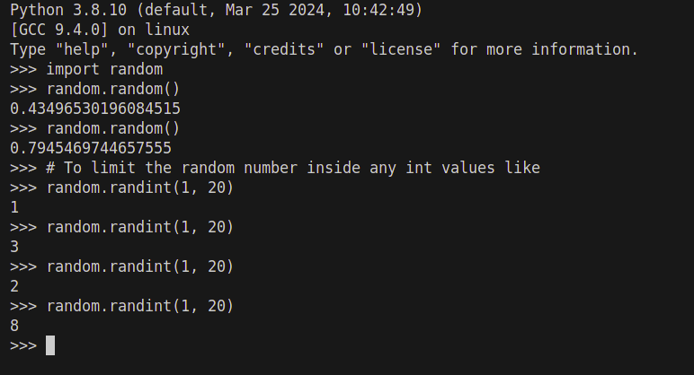

    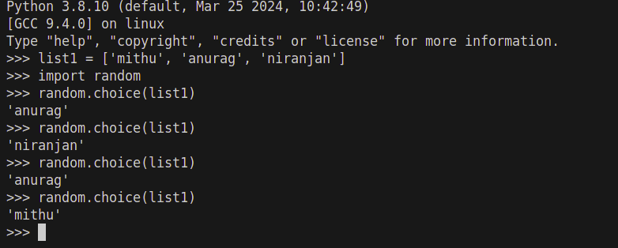

    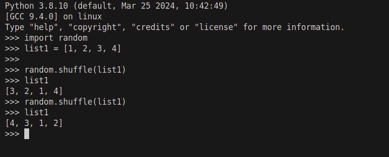

    decimal: It is use to do precise calculation over decimal values

    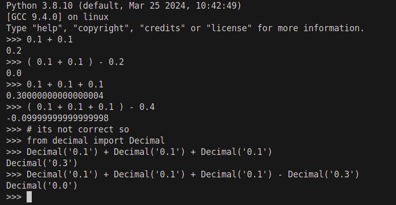

- Sets :

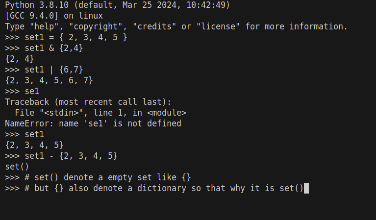